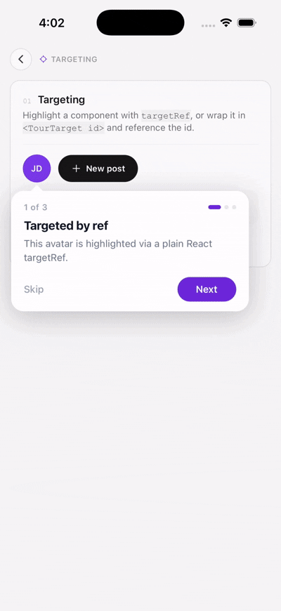
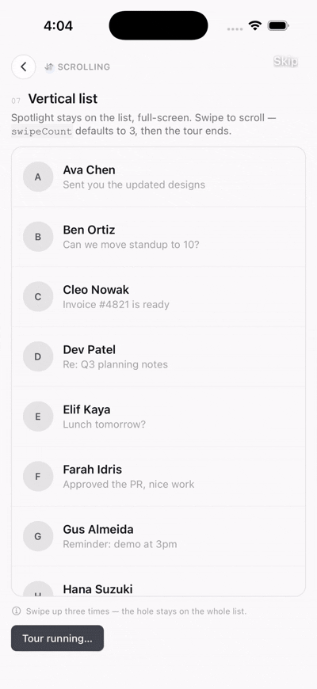

<div align="center">

# react-native-tour-guide

**Spotlight tours, coach marks, and onboarding walkthroughs for React Native.**
Expo-first. Zero native modules. TypeScript throughout.

[](https://www.npmjs.com/package/react-native-tour-guide)
[](https://www.npmjs.com/package/react-native-tour-guide)
[](./LICENSE)
[](./src/index.ts)
[](https://docs.expo.dev/)
[](#requirements)

</div>

## Demo

<p align="center">
<i>iOS simulator · Android device — the same demo, every screen a different feature: targeting by ref, id, or region, six bundled themes, custom tooltips, backdrop &amp; motion, play-once persistence, auto-scroll lists, swipe-hint gesture tours, edge-aware tooltip flips.</i>
</p>

<table>
<tr>
<td align="center" valign="top" width="50%">
<h3>🎯 Targeting</h3>
<p>Highlight any view — by <code>targetRef</code>, <code>&lt;TourTarget id&gt;</code>, or a fixed region.</p>

</td>
<td align="center" valign="top" width="50%">
<h3>📜 List tours</h3>
<p>Keep the spotlight on the list. The user swipes — the hole stays put.</p>

</td>
</tr>
</table>

---

`react-native-tour-guide` highlights a real component on screen with an
animated spotlight, shows a tooltip that auto-places itself and points a
caret back at the target, and walks the user through as many steps as you
give it. No native code, no config plugin, no prebuild — install it and go.

```tsx
const { startTour } = useTourGuide();

startTour([
  { id: "compose", targetRef: buttonRef, title: "Compose", description: "Tap here to start a new post." },
]);
```

## Features

| | |
| --- | --- |
| 🎯 **Three ways to target** | a `targetRef`, a `<TourTarget id>` wrapper, or a fixed `targetRegion` — no ref plumbing required |
| ✨ **Animated spotlight** | an SVG mask cut out of the scrim, morphing between steps with Reanimated, with an optional ring and pulse |
| 💬 **Auto-placed tooltip** | flips to whichever side of the target has room, and keeps its caret pointed at the target even when clamped to the screen edge |
| 🎨 **Six bundled themes** | `light`, `dark`, `minimal`, `vibrant`, `ocean`, `sunset` — or compose your own with `createTheme()` |
| 🧩 **Full step lifecycle** | async `before`, `delayBefore`, `autoAdvance`, per-step callbacks, configurable backdrop behavior, conditional steps |
| 📡 **Events** | `start`, `stepChange`, `end`, `skip`, `pause`, `resume` — subscribe with `events.on(...)` |
| 📜 **List tours** | `useTourScroll()` brings off-screen rows into view, or keeps the spotlight on a list while the user swipes through it |
| ✋ **Gesture demos** | `swipeHint` mimes a swipe with an animated hand — no Next/Back; the list moves, the hole stays put |
| 💾 **Play-once persistence** | `useTourPersistence` works with any AsyncStorage/MMKV-shaped adapter |
| 📦 **Zero native code** | works in Expo Go, dev builds, and bare React Native alike — no config plugin, no prebuild |
| 🖌️ **Looks right immediately** | the built-in tooltip is styled with real `StyleSheet` values, so it renders correctly with or without NativeWind/Tailwind in your app |
| 🧪 **Well tested** | 140+ unit and render tests across the spotlight, tooltip, geometry, scroll, and provider |

## Requirements

This package is JavaScript only — no native modules, no config plugin, no
prebuild. It runs on **both the old architecture (Paper) and the New
Architecture (Fabric)**.

| | |
| --- | --- |
| **React Native** | 0.71 or later (tested on 0.81) |
| **React** | 18 or later (works with 19) |
| **Expo** | SDK 49 or later — Expo Go, development builds, and prebuild |
| **iOS / Android** | both |
| **Architecture** | Paper (old) and Fabric (new) |
| **Peers** | `react-native-reanimated` ≥ 3, `react-native-svg` ≥ 13 |

Bare React Native apps need the Reanimated Babel plugin. Expo apps usually
already have it.

## Installation

```bash
npx expo install react-native-tour-guide react-native-svg react-native-reanimated
```

Bare React Native (npm or yarn):

```bash
npm install react-native-tour-guide react-native-svg react-native-reanimated
# or
yarn add react-native-tour-guide react-native-svg react-native-reanimated
```

Reanimated needs its Babel plugin — see the
[Reanimated install guide](https://docs.swmansion.com/react-native-reanimated/docs/fundamentals/getting-started/)
if it isn't already set up (most Expo apps have it).

## Quick start

Mount the provider once, render one overlay near the root, then drive
everything from `useTourGuide()`.

```tsx
import { useRef } from "react";
import { View, Text, Pressable } from "react-native";
import {
  TourGuideProvider,
  TourGuideOverlay,
  useTourGuide,
  type TourStep,
} from "react-native-tour-guide";

function Screen() {
  const buttonRef = useRef<View>(null);
  const { startTour } = useTourGuide();

  const steps: TourStep[] = [
    {
      id: "compose",
      targetRef: buttonRef,
      title: "Compose",
      description: "Tap here to start a new post.",
      spotlightBorderRadius: 999,
    },
  ];

  return (
    <Pressable ref={buttonRef} onPress={() => startTour(steps)}>
      <Text>New post</Text>
    </Pressable>
  );
}

export default function App() {
  return (
    <TourGuideProvider>
      <Screen />
      <TourGuideOverlay />
    </TourGuideProvider>
  );
}
```

`TourGuideOverlay` can live anywhere inside the provider — most apps put it
once at the root, right after their navigator.

## Guides

### Targeting a component

<p align="center">
  
</p>

Point a step at a component with a plain `targetRef`:

```tsx
const avatarRef = useRef<View>(null);

<View ref={avatarRef}>...</View>;

startTour([{ id: "avatar", targetRef: avatarRef, title: "…", description: "…" }]);
```

...or skip the ref entirely by wrapping the component in `<TourTarget id>`
and referencing that id — handy when the target is deep in a child component
you don't want to thread a ref through:

```tsx
import { TourTarget } from "react-native-tour-guide";

<TourTarget id="header-avatar">
  <Avatar />
</TourTarget>;

startTour([
  {
    id: "avatar",
    targetId: "header-avatar",
    title: "Your profile",
    description: "Tap your avatar any time to edit your profile.",
  },
]);
```

A third option, `targetRegion: { x, y, width, height }`, highlights a fixed
screen region with no component involved at all — useful for pointing at
something rendered outside your React tree (a native tab bar icon, a status
bar area).

### Step lifecycle

Each step can gate itself on async work, wait before showing, and auto-advance:

```tsx
{
  id: "notifications",
  targetId: "bell-icon",
  title: "Stay in the loop",
  description: "We'll notify you here.",
  before: async () => { await openDrawer(); },   // awaited before measuring
  delayBefore: 200,                                // then wait 200ms
  autoAdvance: 2500,                                // then auto-advance after 2.5s
}
```

`active: false` removes a step from the tour without renumbering the rest —
useful for conditionally skipping a step based on app state:

```tsx
{ id: "beta-badge", targetId: "badge", active: user.isBetaTester, ... }
```

### Themes

```tsx
import { darkTheme, oceanTheme } from "react-native-tour-guide";

startTour(steps, darkTheme);
startTour(steps, { ...oceanTheme, showProgressDots: false });
```

Bundled: `lightTheme` (default), `darkTheme`, `minimalTheme`, `vibrantTheme`,
`oceanTheme`, `sunsetTheme` — also available as `themes.light`, `themes.dark`,
etc. A theme is just `tooltipStyles` + `spotlightStyles`, so building your own
is a matter of picking colors:

```tsx
import { createTheme } from "react-native-tour-guide";

const brandTheme = createTheme({
  tooltipStyles: { backgroundColor: "#111827", primaryButtonColor: "#F97316" },
  spotlightStyles: { overlayOpacity: 0.85, pulseColor: "#F97316" },
});
```

### Style tokens

Prefer overriding a single value over building a whole theme? Pass
`tooltipStyles` / `spotlightStyles` directly in the tour config — anything you
don't set falls back to the default theme:

```tsx
startTour(steps, {
  tooltipStyles: {
    backgroundColor: "#111827",
    titleColor: "#FFFFFF",
    primaryButtonColor: "#F97316",
  },
  spotlightStyles: { overlayOpacity: 0.85, enablePulse: false },
});
```

<details>
<summary><strong>All tooltip tokens</strong></summary>

`backgroundColor`, `borderRadius`, `borderColor`, `borderWidth`, `titleColor`,
`descriptionColor`, `stepCounterColor`, `primaryButtonColor`,
`primaryButtonTextColor`, `secondaryButtonColor`, `secondaryButtonTextColor`,
`skipButtonTextColor`, `progressDotColor`, `progressDotActiveColor`,
`showArrow`, `shadow`, `maxWidth`.

</details>

<details>
<summary><strong>All spotlight tokens</strong></summary>

`overlayColor`, `overlayOpacity`, `borderColor`, `borderWidth`, `enablePulse`,
`pulseColor`, `pulseWidth`, `pulseDuration`.

</details>

### Per-slot style overrides

For a one-off tweak that isn't a color — a custom font, some extra padding —
pass raw RN styles via `styles`. These are applied last, so they win over
both the defaults and the active theme:

```tsx
startTour(steps, {
  ...darkTheme,
  styles: {
    container: { paddingHorizontal: 24 },
    title: { fontFamily: "Inter_700Bold", fontSize: 19 },
    primaryButton: { borderRadius: 8 },
  },
});
```

<details>
<summary><strong>All style slots</strong></summary>

`container`, `stepCounter`, `progressDot`, `progressDotActive`, `title`,
`description`, `footer`, `primaryButton`, `primaryButtonText`,
`secondaryButton`, `secondaryButtonText`, `skipButtonText`.

</details>

### A fully custom tooltip

Need something the token system can't express — a different layout, an
illustration, your own component library? Replace the tooltip entirely with
`renderTooltip`, per step or for the whole tour:

```tsx
import type { TooltipProps } from "react-native-tour-guide";

function MyTooltip({ step, isLast, onNext, config }: TooltipProps) {
  return (
    <View style={{ borderRadius: 16, backgroundColor: "#4F46E5", padding: 16 }}>
      <Text style={{ fontSize: 16, fontWeight: "700", color: "white" }}>{step.title}</Text>
      <Text style={{ marginTop: 4, color: "#E0E7FF" }}>{step.description}</Text>
      <Pressable onPress={onNext} style={{ marginTop: 12, alignSelf: "flex-end" }}>
        <Text style={{ color: "white", fontWeight: "600" }}>
          {isLast ? config.doneButtonText : config.nextButtonText}
        </Text>
      </Pressable>
    </View>
  );
}

startTour(steps, { renderTooltip: (props) => <MyTooltip {...props} /> });
```

`renderTooltip` is a component you write, compiled by your own app's
bundler — so if your app uses NativeWind, Tailwind classes work fine here.
See [NativeWind / Tailwind](#nativewind--tailwind) for why that's not true
of the built-in tooltip.

### Backdrop behavior, timing & motion

Configure what tapping outside the spotlight does — per step, or as the
default for the whole tour:

```tsx
startTour(steps, { defaultBackdropBehavior: "next" });   // tap anywhere to advance
startTour(steps, { defaultBackdropBehavior: "dismiss" }); // tap anywhere to end the tour
```

```tsx
{ ...step, backdropBehavior: "dismiss" }  // override for just this step
```

Turn off the morph animation for an instant cut instead:

```tsx
startTour(steps, { motion: "none", animationDuration: 0 });
```

### Tours through lists

<p align="center">
  
</p>

Two patterns share the same `useTourScroll()` binding.

**1. Spotlight a row that's off screen.** The tour scrolls it into view,
waits for it to settle, then measures and spotlights that row:

```tsx
import { useTourScroll } from "react-native-tour-guide";

const { ref, scrollProps, handle, reset } = useTourScroll();

<ScrollView ref={ref} {...scrollProps}>
  <TourTarget id="row-17">
    <Row />
  </TourTarget>
</ScrollView>;

startTour([
  {
    id: "row",
    targetId: "row-17",
    title: "Way down here",
    description: "The tour scrolled to find this.",
    scroll: { handle },
  },
]);
```

**2. Teach the list itself.** Keep the spotlight on the list, hide the
tooltip, and let the user swipe. The hole does not jump onto child rows.
See [gesture tours](#swipe-hints-gesture-tours).

**Horizontal lists** — pass the axis on the hook:

```tsx
const { ref, scrollProps, handle, reset } = useTourScroll({ horizontal: true });
```

**Paginated / virtualized lists** need an `index` (`scrollToIndex`) instead
of a pixel offset — paging snaps to whole pages, and a far-down `FlatList`
row isn't mounted yet so it can't be measured:

```tsx
{ ...step, scroll: { handle, index: 0, viewPosition: 0 } }
```

Call `reset()` when you start the tour so the list (and swipe count) always
begin at the first item:

```tsx
onPress={() => {
  reset();
  startTour(steps, { tourId: "inbox" });
}}
```

`scroll` options: `handle` (required), `padding` (space around the row,
default 24), `settleDelay` (ms to wait after a scroll, default 400),
`index`, `viewPosition` (`0` = start, `0.5` = centre, `1` = end), and
`pageSize` (px per counted swipe on a non-paging list).

`useTourScroll` stores the offset in a ref, so scrolling never re-renders
your list. It wraps any `onScroll` you pass in. Works with `ScrollView`,
`FlatList`, `SectionList`, and their `Animated` variants.

### Swipe hints (gesture tours)

A spotlight can't explain that a rail scrolls sideways. `swipeHint` draws an
animated hand over the target **and turns the step into a gesture tour**:
no tooltip, no Next/Back. The user swipes in that direction (the opposite
goes back). Pair it with `scroll` so the **list moves under a fixed
spotlight**.

```tsx
{
  id: "inbox",
  targetId: "inbox-list",
  title: "Your inbox",
  description: "Swipe up to catch up.",
  swipeHint: "up",
  scroll: { handle, pageSize: 192 }, // px per swipe; spotlight stays on the list
}
```

```tsx
swipeHint: { direction: "left", distance: 90, duration: 1200, color: "#0F172A" }
```

Directions: `"up"`, `"down"`, `"left"`, `"right"`. Hand options: `distance`,
`duration`, `repeatDelay`, `size`, `color`, `showTrail`, `trailColor`.

A swipe-hint step takes **3 swipes** by default, then advances or ends the
tour. Override per step or for the whole tour:

```tsx
{ ...step, swipeHint: "up", swipeCount: 5 }

startTour(steps, { swipeCount: 2 })
```

- **Paging lists** — `scroll.index` is the start page; each swipe does
  `index + n`. The third swipe (by default) ends the tour.
- **Vertical / horizontal lists** — `scroll.pageSize` is how far one swipe
  scrolls, in px. The spotlight stays on the list, not on a child row.
- **Skip** stays in the top-right, below the status bar.
- Call `reset()` from `useTourScroll()` when starting so the list returns to
  index 0 and swipe counting starts over.

To keep a tooltip and buttons instead of a gesture:

```tsx
{ ...step, swipeHint: "left", hideTooltip: false, advanceOnSwipe: false }
```

The hand sits on the *spotlit* target (the undimmed hole), so it defaults to
dark. Override `color` / `trailColor` on a dark target. Only transform and
opacity animate, so this stays on the UI thread. **Reduce Motion** parks the
hand mid-swipe instead of looping.

### Play a tour only once

`useTourPersistence` wraps `startTour` so a tour (keyed by `tourId`) only
plays once, using any `{ getItem, setItem, removeItem? }` storage adapter —
AsyncStorage, MMKV, or your own:

```tsx
import AsyncStorage from "@react-native-async-storage/async-storage";
import { useTourPersistence } from "react-native-tour-guide";

const { startTour, resetTour } = useTourPersistence(AsyncStorage);

startTour(onboardingSteps, { tourId: "onboarding-v1" });
resetTour("onboarding-v1"); // clear the flag — show it again next time
```

### Listening to tour events

The event emitter is shared across every tour in the app — handy for
analytics:

```tsx
const { events } = useTourGuide();

useEffect(() => {
  const unsubscribe = events.on("stepChange", ({ from, to }) => {
    analytics.track("tour_step", { from, to });
  });
  return unsubscribe;
}, [events]);
```

Available events: `start`, `stepChange`, `end`, `skip`, `pause`, `resume`.

### NativeWind / Tailwind

The built-in tooltip is styled with `StyleSheet`, so it looks correct
whether or not your app uses NativeWind. Do not pass Tailwind `className`
to the built-in tooltip — use `tooltipStyles` / `styles` instead.

If you want Tailwind classes, replace the tooltip with `renderTooltip`.
That component is compiled by your app, so NativeWind works there.

## API reference

### `useTourGuide()`

```ts
const {
  startTour,   // (steps: TourStep[], config?: TourGuideConfig) => void
  nextStep, prevStep, goToStep, skipTour, endTour, pauseTour, resumeTour,
  isActive, isPaused, currentStep, currentStepIndex, totalSteps, tourId,
  events,      // .on('start'|'stepChange'|'end'|'skip'|'pause'|'resume', handler) => unsubscribe
} = useTourGuide();
```

### `useTourScroll()`

```ts
const { ref, scrollProps, handle, reset } = useTourScroll({
  horizontal?: boolean,  // default false
  onScroll?: (event) => void,  // your handler still runs
});

<FlatList ref={ref} {...scrollProps} ... />

// Pass `handle` on a step's `scroll` option.
// Call `reset()` when starting a list tour so it begins at index 0.
```

### `TourStep`

| Property | Type | Default | Purpose |
| --- | --- | --- | --- |
| `id` | `string` | required | Unique step id |
| `targetRef` | `RefObject<View>` | — | Component to highlight |
| `targetId` | `string` | — | Id of a `<TourTarget>` wrapper |
| `targetRegion` | `{x,y,width,height}` | — | Fixed region, no ref needed |
| `title` / `description` | `string` | required | Tooltip copy |
| `tooltipPosition` | `'top'\|'bottom'\|'left'\|'right'\|'auto'` | `'auto'` | Preferred side |
| `spotlightPadding` | `number` | `8` | Space around the cutout |
| `spotlightBorderRadius` | `number` | `12` | Cutout corner radius (`999` = circle) |
| `active` | `boolean` | `true` | Exclude from the tour when `false` |
| `backdropBehavior` | `'next'\|'dismiss'\|'none'` | `'none'` | Tap-outside behavior |
| `autoAdvance` | `number` | — | Auto-advance after N ms |
| `before` | `() => Promise<void>\|void` | — | Awaited before measuring |
| `delayBefore` | `number` | — | Static delay after `before` |
| `scroll` | `TourScrollOptions \| TourScrollOptions[]` | — | Scroll a list before spotlighting |
| `swipeHint` | `'up'\|'down'\|'left'\|'right' \| SwipeHintConfig` | — | Animated hand + gesture tour |
| `renderTooltip` | `(props) => ReactNode` | — | Per-step custom tooltip |
| `motion` | `'morph'\|'fade'\|'none'` | config | Transition style |
| `hideNextButton` / `hidePrevButton` / `hideSkipButton` / `hideControls` | `boolean` | `false` | Hide controls |
| `hideTooltip` | `boolean` | `true` when `swipeHint` is set | Hide the whole tooltip card |
| `advanceOnSwipe` | `boolean` | `true` when `swipeHint` is set | Swipe in the hinted direction to scroll / count |
| `swipeCount` | `number` | `3` when `swipeHint` is set | Swipes before this step advances |
| `onNext` / `onPrev` / `onSkip` / `onSpotlightPress` | `() => void` | — | Callbacks |
| `accessibilityLabel` | `string` | — | Screen reader label |

### `TourGuideConfig`

| Property | Type | Default |
| --- | --- | --- |
| `tooltipStyles` | `TooltipStyles` | see [tokens](#style-tokens) |
| `spotlightStyles` | `SpotlightStyles` | see [tokens](#style-tokens) |
| `styles` | `TooltipSlotStyles` | see [per-slot overrides](#per-slot-style-overrides) |
| `renderTooltip` | `(props) => ReactNode` | — |
| `showProgressDots` | `boolean` | `true` |
| `showStepCounter` | `boolean` | `true` |
| `nextButtonText` / `prevButtonText` / `skipButtonText` / `doneButtonText` | `string` | `Next` / `Back` / `Skip` / `Done` |
| `animationDuration` | `number` | `320` |
| `motion` | `'morph'\|'fade'\|'none'` | `'morph'` |
| `tourId` | `string` | — |
| `defaultBackdropBehavior` | `'next'\|'dismiss'\|'none'` | `'none'` |
| `swipeCount` | `number` | `3` |
| `onTourStart` / `onTourEnd` / `onStepChange` | callbacks | — |

## Example app

A full showcase — targeting, themes, custom tooltips, persistence, plus
vertical, horizontal, and paginated list tours:

```bash
git clone https://github.com/kaisarsofi/react-native-tour-guide.git
cd react-native-tour-guide/example
npm install
npx expo run:ios      # or: npx expo start
```

## Roadmap

- [ ] Interactive spotlight (pass touches through the cutout)
- [x] Auto-scroll / gesture tours for `ScrollView` / `FlatList`
- [ ] Blur backdrop option

Have a feature request? [Open an issue](https://github.com/kaisarsofi/react-native-tour-guide/issues).

## Contributing

```bash
git clone https://github.com/kaisarsofi/react-native-tour-guide.git
cd react-native-tour-guide
npm install
npm run validate   # lint + format check + typecheck + tests
```

A Husky pre-commit hook runs `lint-staged` (ESLint + Prettier on staged
files) and a full typecheck automatically — no extra setup needed once
`npm install` has run.

## License

MIT © [kaisarsofi](https://github.com/kaisarsofi)
