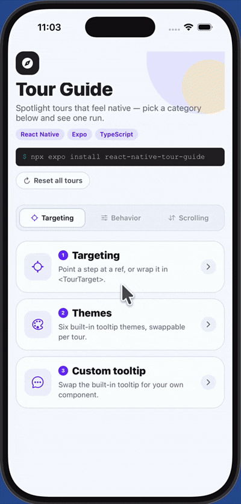
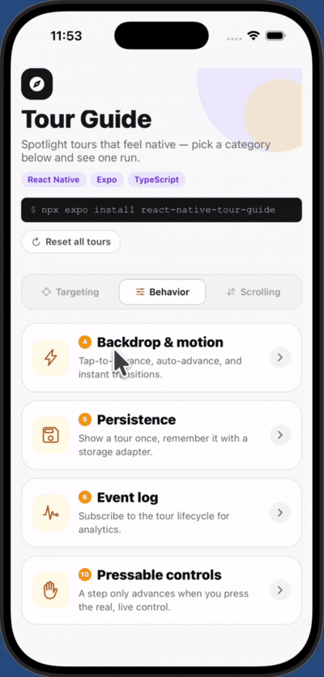
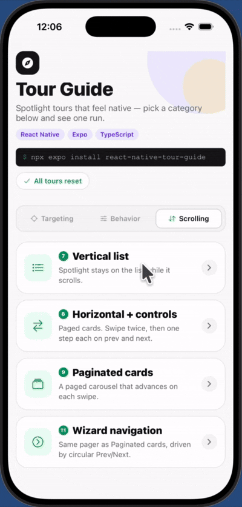

# react-native-tour-guide

**Product tours for React Native that actually feel native.** An animated
spotlight, a tooltip that places itself, and a list-aware engine that scrolls,
swipes, and remembers — in one component, zero native code.


If this saves you a sprint of edge cases, a ⭐ on
[GitHub](https://github.com/kaisarsofi/react-native-tour-guide) keeps it maintained.

---

## Why this one

- 🎯 **Zero setup, real results.** Wrap a provider, wrap a list, done — the
  library handles measuring, scrolling, placement, and safe areas for you.
- 📜 **List tours that don't fight you.** `<TourScrollList>` turns any
  `FlatList` / `FlashList` / `LegendList` into a guided tour with no refs, no
  `useEffect`, no manual scroll math.
- ✋ **Real gestures, not fake ones.** Swipe-hint steps let the actual list
  scroll natively wherever possible — no captured, simulated touches.
- 📦 **Ships nothing extra.** No native modules, no config plugin, no
  prebuild. Works in Expo Go, dev builds, and bare React Native alike.
- 🧪 **Actually tested.** 200+ unit and render tests across the spotlight,
  scroll engine, gestures, and provider — this isn't a demo dressed up as a
  library.

## See it

| **Targeting** | **Behavior** | **Scrolling** |
| --- | --- | --- |
|  |  |  |
| ref or id-based targeting, six themes, custom tooltips | backdrop taps, play-once persistence, press-the-real-button | auto-scroll lists, swipe hints, paging, wizard nav |

_Same example app, iOS simulator and Android device._

## Two components. That's the whole API surface you touch daily.

```tsx
import { TourGuideProvider, TourGuideOverlay, useTourGuide } from "react-native-tour-guide";

function App() {
  return (
    <TourGuideProvider>
      <Screen />
      <TourGuideOverlay />
    </TourGuideProvider>
  );
}

function Screen() {
  const buttonRef = useRef<View>(null);
  const { startTour } = useTourGuide();

  return (
    <Pressable
      ref={buttonRef}
      onPress={() =>
        startTour([
          {
            id: "compose",
            targetRef: buttonRef,
            title: "Compose",
            description: "Tap here to start a new post.",
          },
        ])
      }
    >
      <Text>New post</Text>
    </Pressable>
  );
}
```

## List tours in one wrapper

The most common real-world tour — teach the list itself, spotlight fixed,
user swipes to catch up — used to mean wiring a ref, a `useEffect`, and
remembering that paging lists scroll differently. Now it's one component:

```tsx
import { FlashList } from "@shopify/flash-list";
import { TourScrollList } from "react-native-tour-guide";
import { useIsFocused } from "@react-navigation/native";

<TourScrollList
  as={FlashList}
  id="item-list"
  tourId="item-list-tour"
  persist
  title="Your items"
  description="Swipe up to see more."
  swipeHint="up"
  active={useIsFocused()}
  data={items}
  renderItem={({ item }) => <Card item={item} />}
  pagingEnabled
/>;
```

It starts itself the moment `data` arrives and the screen is actually
visible, resets the scroll position for you, auto-detects paging, and
forwards every other prop straight to `FlashList` — swap in `LegendList` or
plain `FlatList` with no other change. Behind a tab navigator? `active`
keeps the tour from firing on a screen that's mounted but off-screen.

**Need the tour to also point at something *outside* the list** — nav
arrows next to a carousel, a filter chip above it? `<TourScrollList>` only
builds one step, for the list itself. Drop to `useTourScroll()` +
`TourTarget` and write the steps yourself — the arrows below drive the
same `handle` the list's own step scrolls with:

```tsx
import { useTourScroll, TourTarget, useTourGuide } from "react-native-tour-guide";

const { ref, scrollProps, handle, reset } = useTourScroll({ horizontal: true });
const { startTour, nextStep } = useTourGuide();

const scrollByPage = (delta: number) => {
  const page = Math.round(handle.offsetRef.current.x / pageWidth) + delta;
  handle.ref.current?.scrollToOffset?.({ offset: page * pageWidth, animated: true });
};

const steps = [
  {
    id: "rail",
    targetId: "category-rail",
    title: "Swipe the cards",
    description: "One card per screen.",
    swipeHint: "left",
    scroll: { handle, index: 0 },
  },
  {
    id: "prev",
    targetId: "rail-prev",
    title: "Previous",
    description: "Tap the highlighted arrow.",
    hideNextButton: true,
    onSpotlightPress: () => { scrollByPage(-1); nextStep(); },
  },
  {
    id: "next",
    targetId: "rail-next",
    title: "Next",
    description: "Tap this arrow to finish.",
    hideNextButton: true,
    onSpotlightPress: () => { scrollByPage(1); nextStep(); },
  },
];

reset();
startTour(steps, { tourId: "rail" });

<TourTarget id="category-rail">
  <FlatList ref={ref} {...scrollProps} horizontal pagingEnabled data={items} ... />
</TourTarget>
<TourTarget id="rail-prev">
  <Pressable onPress={() => scrollByPage(-1)}>{/* ‹ */}</Pressable>
</TourTarget>
<TourTarget id="rail-next">
  <Pressable onPress={() => scrollByPage(1)}>{/* › */}</Pressable>
</TourTarget>
```

Full working version, including waiting for the rail's real width before
starting:
[`example/demos/HorizontalListControlsTour.tsx`](example/demos/HorizontalListControlsTour.tsx).

## Install

```bash
npx expo install react-native-tour-guide react-native-svg react-native-reanimated
```

```bash
npm install react-native-tour-guide react-native-svg react-native-reanimated
```

That's it for JS-only usage. Reanimated needs its Babel plugin if your app
doesn't have it already — see the
[install guide](https://docs.swmansion.com/react-native-reanimated/docs/fundamentals/getting-started/).

<details>
<summary><strong>Requirements & optional dependencies</strong></summary>

| React Native | React        | Expo               | Architecture         |
| ------------- | ------------- | ------------------- | --------------------- |
| 0.71+         | 18+ (works with 19) | SDK 49+ (Go, dev builds, prebuild) | Paper and Fabric, both |

`react-native-reanimated` (≥3) and `react-native-svg` (≥13) are required
peers. `@shopify/flash-list` and `@legendapp/list` are **optional** —
only needed if you use `<TourScrollList as={FlashList}>` /
`as={LegendList}`. Plain `ScrollView`, `FlatList`, and `SectionList` need
nothing extra.

</details>

## Everything else, in one pass

**Targeting** — `targetRef`, `<TourTarget id>`, or a fixed `targetRegion`.
No ref plumbing required for the ones you don't want to thread through.

**Themes & styling** — six bundled themes (`light`, `dark`, `minimal`,
`vibrant`, `ocean`, `sunset`), token overrides for one-off colors, or
replace the tooltip entirely with `renderTooltip` — a real component your
own bundler compiles, so Tailwind/NativeWind classes work there.

**Step lifecycle** — async `before`, `delayBefore`, `autoAdvance`,
per-step callbacks, conditional `active` steps, configurable backdrop
behavior (tap to advance, dismiss, or nothing).

**Gesture tours** — `swipeHint` draws an animated hand and turns a step
into a swipe-to-advance demo. When the target's own list can be subscribed
to, the tour counts real native swipes instead of capturing touches — the
list scrolls itself, exactly as it would with no tour running.

```tsx
{
  id: "inbox",
  targetId: "inbox-list",
  title: "Your inbox",
  description: "Swipe up to catch up.",
  swipeHint: "up",
  scroll: { handle },
}
```

**Press the real button** — `onSpotlightPress` fires when the user taps
the highlighted control itself, not a tooltip shortcut. Pairs with
`hideNextButton` for "teach the live action" steps, or with
`createWizardTourSteps()` for a Prev/Next-driven carousel.

**Play once, persist forever** — `persist: true` plus `tourId` and it
just won't show again, zero storage setup. Pass `TourGuideProvider` a real
adapter (`storage={AsyncStorage}`, MMKV, anything shaped like
`{ getItem, setItem, removeItem? }`) to survive restarts.

**Events** — `events.on('start' | 'stepChange' | 'end' | 'skip' | 'pause' | 'resume', handler)`
for analytics, wired the same way anywhere in the tree.

## API reference

### `useTourGuide()`

```ts
const {
  startTour, // (steps: TourStep[], config?: TourGuideConfig) => void
  nextStep, prevStep, goToStep, skipTour, endTour, pauseTour, resumeTour, resetTour,
  isActive, isPaused, currentStep, currentStepIndex, totalSteps, tourId,
  events,
} = useTourGuide();
```

Every function here is referentially stable — safe to drop straight into a
`useEffect` dependency array, no `eslint-disable` required.

### `<TourScrollList>`

```tsx
<TourScrollList
  as={FlashList}              // stable reference: FlatList, SectionList, FlashList, LegendList
  id="item-list"               // TourTarget id + step targetId
  tourId="item-list-tour"
  persist
  title="Your items"
  description="Swipe up to see more."
  swipeHint="up"
  active={useIsFocused()}      // default true
  pagingEnabled                 // auto-detected: steps with scrollToIndex(0)
  spotlightPadding={8}          // or { horizontal, vertical } — default 8/8
  spotlightBorderRadius={12}
  wrapperStyle={{ flex: 1 }}    // default
  tourStep={{ ... }}            // merged over the generated step
  tourConfig={{ ... }}          // merged into startTour's config
  data={items}
  renderItem={...}
/>
```

### `useTourScroll()`

```ts
const { ref, scrollProps, handle, reset } = useTourScroll({
  horizontal?: boolean,
  pagingEnabled?: boolean,   // steps with scrollToIndex(0) unless `index` is set
  onScroll?: (event) => void,
});

<FlatList ref={ref} {...scrollProps} ... />
// handle → a step's `scroll` option. reset() → jump back to the top.
```

### `TourStep`

| Property | Type | Default | Purpose |
| --- | --- | --- | --- |
| `id` | `string` | required | Unique step id |
| `targetRef` / `targetId` / `targetRegion` | see [Targeting](#everything-else-in-one-pass) | — | What to highlight |
| `title` / `description` | `string` | required | Tooltip copy |
| `tooltipPosition` | `'top'\|'bottom'\|'left'\|'right'\|'auto'` | `'auto'` | Preferred side |
| `spotlightPadding` | `number \| { horizontal?, vertical? }` | `8` | Space around the cutout |
| `spotlightBorderRadius` | `number` | `12` | Cutout corner radius (`999` = circle) |
| `active` | `boolean` | `true` | Exclude from the tour when `false` |
| `backdropBehavior` | `'next'\|'dismiss'\|'none'` | `'none'` | Tap-outside behavior |
| `autoAdvance` | `number` | — | Auto-advance after N ms |
| `before` / `delayBefore` | fn / `number` | — | Gate on async work, then wait |
| `scroll` | `TourScrollOptions \| [...]` | — | Scroll a list into view first |
| `swipeHint` | direction or `SwipeHintConfig` | — | Animated hand + gesture tour |
| `renderTooltip` | `(props) => ReactNode` | — | Per-step custom tooltip |
| `hideNextButton` / `hidePrevButton` / `hideSkipButton` / `hideControls` | `boolean` | `false` | Hide controls |
| `swipeCount` | `number` | `3` when `swipeHint` set | Swipes before this step advances |
| `onNext` / `onPrev` / `onSkip` / `onSpotlightPress` | `() => void` | — | Callbacks |

### `TourGuideConfig`

`tooltipStyles`, `spotlightStyles`, `styles`, `renderTooltip`,
`showProgressDots`, `showStepCounter`, `*ButtonText`, `animationDuration`,
`motion`, `tourId`, `persist`, `defaultBackdropBehavior`, `swipeCount`,
`onTourStart` / `onTourEnd` / `onStepChange`.

## Example app

```bash
git clone https://github.com/kaisarsofi/react-native-tour-guide.git
cd react-native-tour-guide/example && npm install && npx expo start
```

Three tabs — Targeting, Behavior, Scrolling — covering every pattern above
with real, runnable code.

## Roadmap

- [ ] Pass touches through the spotlight cutout to the live view
- [ ] Optional blur backdrop
- [ ] Multi-hole / multi-target steps

[Open an issue](https://github.com/kaisarsofi/react-native-tour-guide/issues)
with a feature request.

## Contributing

```bash
git clone https://github.com/kaisarsofi/react-native-tour-guide.git
cd react-native-tour-guide && npm install && npm run validate
```

A Husky pre-commit hook runs lint, format, and typecheck automatically.

## License

MIT © [kaisarsofi](https://github.com/kaisarsofi)
